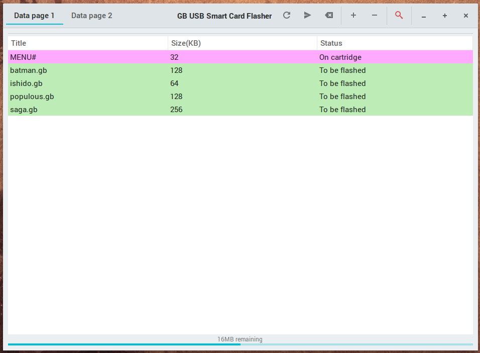

# EMS Front-end
GTK3 front-end for [EMS flasher](https://github.com/mikeryan/ems-flasher) 

  

 

Written in Python 3.  
Uses PyGObject bindings.  

***

##Notes  
- This utility hasn't been tested extensively
- The utility might appear to lock up when flashing
- Sometimes an error actually freezes the utility

***

##Todo  
- Test flashing large ROMs
- Add async and spinner for non-blocking operation
- Bundle with EMS flasher
- Build deb / rpm / etc packages
- Properly handle errors
- Implement search functionality
